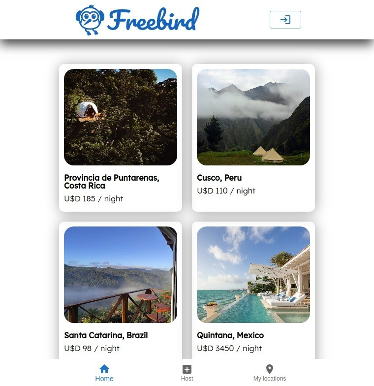
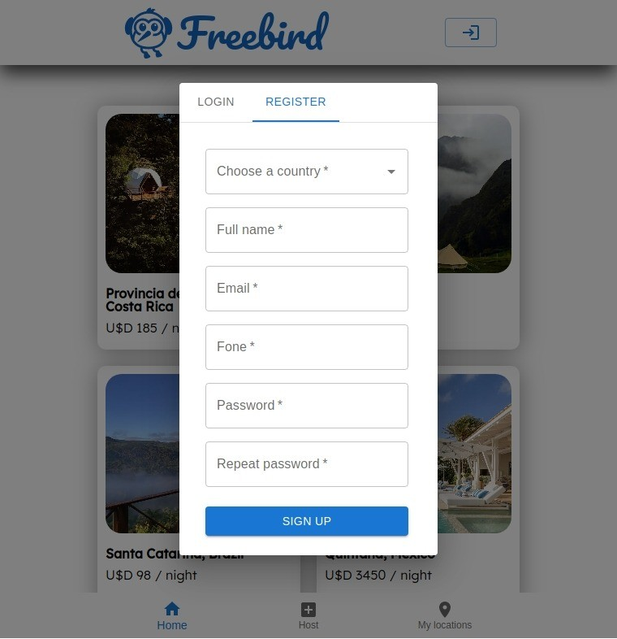
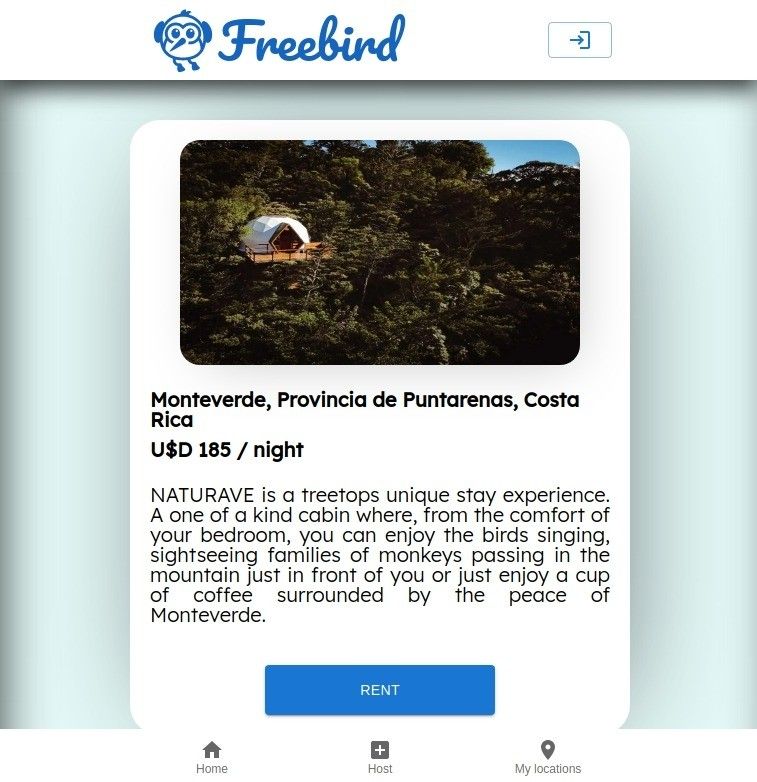
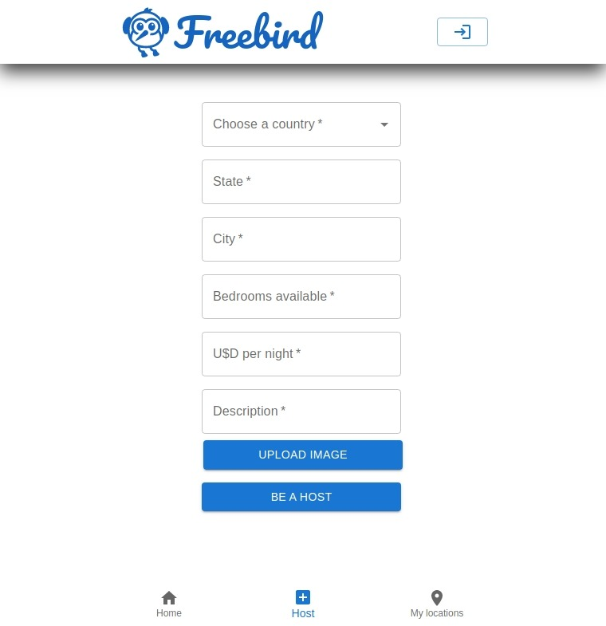
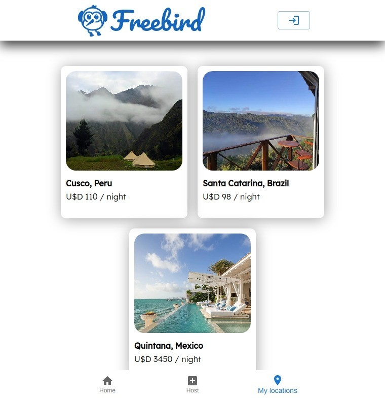

# <p align = "center"> Freebird </p>

#### <p align = "center" style="color:red" > Confira também o [back-end](https://github.com/gabrzeoN/freebird-back) </p>
##
<div align = "center" >
    
    
    
    
    
</div>

***

##  :clipboard: Descrição

Freebird é um serviço online comunitário para as pessoas anunciarem, descobrirem e reservarem acomodações e meios de hospedagem.

***

## :computer:	 Tecnologias e Conceitos 

- React
- MUI
- styled-components
- Node.js
- Postgresql com Prisma
- Supabase
- Arquitetura em camadas
- Axios
- joi
- bcrypt

***

## 🏁 Rodando o back-end

1. Primeiro, configure o [back-end](https://github.com/gabrzeoN/freebird-back)

2. Faça o clone desse repositório na sua maquina:
```
    git clone https://github.com/gabrzeoN/freebird-front.git
    ou
    git clone git@github.com:gabrzeoN/freebird-front.git
```

2. Depois, dentro da pasta, rode o seguinte comando para instalar as dependencias
```
    npm install
```

3. Configure o arquivo **.env**  com base no arquivo **.env.example**. Note que é necessário configurar um banco de dado de arquivo, o Supabase

4. Para configurar o [Supabase](https://github.com/gabrzeoN/freebird-back), acesse o site e crie um conta

5. Com a conta criada, crie um projeto e entre em projects/setting/api
  
6.  **REACT_APP_SUPABASE_URL** equivale ao **Project URL**, enquanto o **REACT_APP_SUPABASE_ANON_KEY** equivale ao **anon public**, dentro do campo **Project API KEYS**

7. Finalizado o processo, é só inicializar o servidor. Vale lembrar que o banco do Supabase se inicia vazio, por isso, será necesssário adicionar locações para que elas possa ser vizualizadas na página Home
```
npm start
```
